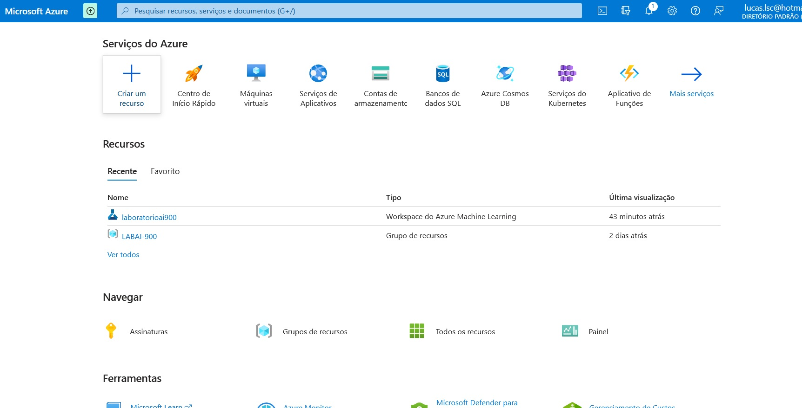
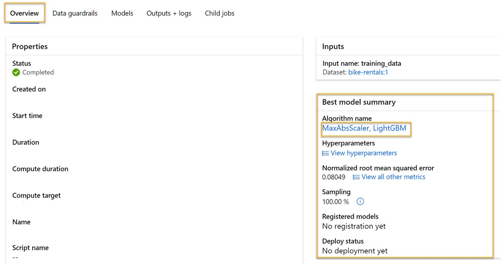

# Trabalhando com Machine Learning na Prática no Azure ML

Passo a passo do projeto Trabalhando com Machine Learning na Prática no Azure ML da DIO.

Links importantes:

[Explore Azure AI Services](https://microsoftlearning.github.io/mslearn-ai-fundamentals/Instructions/Labs/02-content-safety.html)

[Explore Automated Machine Learning in Azure Machine Learning](https://microsoftlearning.github.io/mslearn-ai-fundamentals/Instructions/Labs/01-machine-learning.html)

[Fonte dos dados](https://aka.ms/bike-rentals)

## Passo 1: Criando recurso do Azure Machine Learning

Seguindo o passo a passo do treinamento pelo link fornecido pelo bootcamp para aprendizado primeiramente criamos o recurso do azure Machine leaning

    Primeiro devemos acessar o portal do AzureA que se ahttps://portal.azure.comusando suas credenciais da Microsoft.
    Selecione a+ Criar um recurso, a busca por Aprendizado de máquina, e criar um novoAprendizado de Máquinas dorecurso com as seguintes configurações:
        Assinatura: Sua assinatura do Azure.
        Grupo de recursos: Crie ou selecione um grupo de recursos.
        Nome : Insira um nome exclusivo para o seu workspace.
        Região: Selecione a região geográfica mais próxima.
        Conta de armazenamento: Observe a nova conta de armazenamento padrão que será criada para o seu espaço de trabalho.
        Keyeb dobrás: Observe o novo cofre de chaves padrão que será criado para o seu workspace.
        Insights do aplicativo: Observe o novo recurso padrão de insights de aplicativos que será criado para o seu espaço de trabalho.
        Registro de contêineres: Nenhum (será criado automaticamente na primeira vez que você implantar um modelo em um contêiner).

    Selecione Revisão + criar e, em seguida, selecione Criar. Aguarde a criação do seu espaço de trabalho (sá pode demorar alguns minutos) e, em seguida, vá para o recurso implantado.

    Selecione Estúdio de inicialização (ou abra uma nova guia do navegador e navegue até https://ml.azure.com e entre no estúdio Azure Machine Learning usando sua conta da Microsoft). Feche todas as mensagens exibidas.
    No estúdio de Machine Learning do Azure, você deve ver sua área de trabalho recém-criada. Se não, selecione Todos os espaços de trabalho no menu à esquerda e, em seguida, selecione o espaço de trabalho que você criou.

## Passo 2: Configurando o recurso do Azure Machine Learning

se machine learning automatizado para treinar um modelo

O aprendizado de máquina automatizado permite que você experimente vários algoritmos e parâmetros para treinar vários modelos e identificar o melhor para seus dados. Neste exercício, você usará um conjunto de dados de detalhes históricos do aluguel de bicicletas para treinar um modelo que prevê o número de aluguel de bicicletas que deve ser esperado em um determinado dia, com base em características sazonais e meteorológicas.

    CitationCitação: Os dados utilizados neste exercício são derivados da Capital Bikeshare e são utilizados de acordo com o contrato de licença de dados publicado.

    No estúdio de Machine Learning do Azure, veja a página ML automatizada (em criação).

    Criar uma nova tarefa de ML Automatizada com as seguintes configurações, usando Next conforme necessário para progredir através da interface do usuário:

    Configurações básicas :
        Nome de trabalho : mslearn-bike-automl
        Novo nome de experimento : mslearn-bike-rental
        Descrição: Aprendizado de máquina automatizado para previsão de aluguel de bicicletas
        Tags : Nenhum

    Tipo & dados da tarefa:
        Selecione o tipo de tarefa : Regressão
        Selecione o conjunto de dados: Crie um novo conjunto de dados com as seguintes configurações:
            Tipo de dados:
                Nome : aluguel de bicicletas
                Descrição : Dados históricos de aluguer de bicicletas
                Tipo : Tabular
            Fonte de dados:
                Selecione a partir de arquivos web
            URL da Web:
                URL da Web:https://aka.ms/bike-rentals
                Ignorar a validação de dados : não selecione
            Configurações:
                Formato de arquivo : Delimitado
                Delimitador : Coma
                Encoding : UTF-8 (versão para o usuário)
                Cabeçadores de coluna : Apenas primeiro arquivo tem cabeçalhos
                Ignorar as linhas : Nenhum
                Dataset contém dados multi-linha : não selecione
            Schema ('):
                Inclua todas as colunas que não sejam Caminho
                Revise os tipos detectados automaticamente

        Selecione Criar. Após a criação do conjunto de dados, selecione o conjunto de dados de aluguel de bicicletas para continuar a enviar o trabalho ML Automatizado.

## Passo 3

Configurações de tarefa :

    Tipo de tarefa : Regressão
    Dataset : aluguel de bicicletas
    Coluna alvo : Locação (ingerto)
    Configurações adicionais de configuração:
        Mémétrica primária : Erro quadrado médio de raiz normalizado
        Explique o melhor modelo: Não selecionado
        Use todos os modelos suportados: Não selecionado. Você restringirá o trabalho para tentar apenas alguns algoritmos específicos.
        Modelos permitidos: Selecione apenas RandomForest e LightGBM - normalmente você gostaria de tentar o maior número possível, mas cada modelo adicionado aumenta o tempo que leva para executar o trabalho.
    Limites:Expanda esta seção
        Testes máximos: 3
        Ensaios simultâneos máximos: 3
        O símdia de Max : 3
        Limite de pontuação métrica: 0,085 (para que, se um modelo atingir uma raiz normalizada escore métrico de erro quadrado médio de 0,085 ou menos, o trabalho termina.)
        Tempo limite : 15
        Tempo limite de iteração : 15
        Habilite a rescisão antecipada : Selecionado
    Validação e teste:
        Tipo de validação : Divisões de validação de trem
        Percentagem de dados de validação: 10
        Testar o conjunto de dados : Nenhum

Compute :

    Selecione o tipo de computação : Serverless
    Tipo de máquina virtual: CPU
    Nível da máquina virtual: Dedicado
    Tamanho da máquina virtual : Standard_DS3_V2
    Número de instâncias: 1

Se a sua assinatura restringir os tamanhos de VM disponíveis para você, escolha qualquer tamanho disponível.

Submeta o trabalho de treino. Ele começa automaticamente.

## Passo 4: Métricas do modelo

Quando o trabalho automatizado de aprendizado de máquina for concluído, você pode revisar o melhor modelo treinado.

    Na guia Visão geral do trabalho automatizado de aprendizado de máquina, observe o melhor resumo do modelo. 

Selecione o texto em Nome do Algoritmo para o melhor modelo para visualizar seus detalhes.

Selecione a guia Métricas e selecione os gráficos de resíduos e previstos_true se ainda não estiverem selecionados.

Revise os gráficos que mostram o desempenho do modelo. O gráfico de resíduos mostra os resíduos (as diferenças entre os valores previstos e reais) como um histograma. O gráfico_true previsto compara os valores previstos em relação aos valores reais.

## Passo 5: Teste do modelo

Por fim testamos o modelo

    No Azure Machine Learning studio, no menu esquerdo, selecione Endpoints e abra o ponto de extremidade preditor-augur em tempo real.

    Na página de ponto de extremidade preditual-rentals em tempo real, visualize a guia Teste.

    Nos dados de entrada para testar o painel de endpoint, substitua o modelo JSON pelos seguintes dados de entrada:

<code>
{
  "input_data": {
    "data": [
       {
         "day": 1,
         "mnth": 1,   
         "year": 2022,
         "season": 2,
         "holiday": 0,
         "weekday": 1,
         "workingday": 1,
         "weathersit": 2, 
         "temp": 0.3, 
         "atemp": 0.3,
         "hum": 0.3,
         "windspeed": 0.3 
       }
     ]
  }
}
</code>

A previsão gerada foi: 361.95

