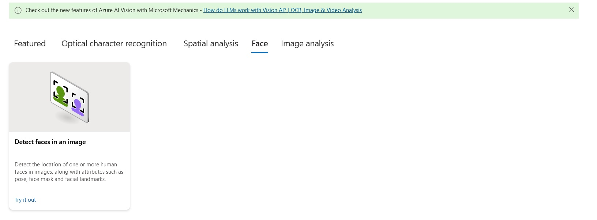
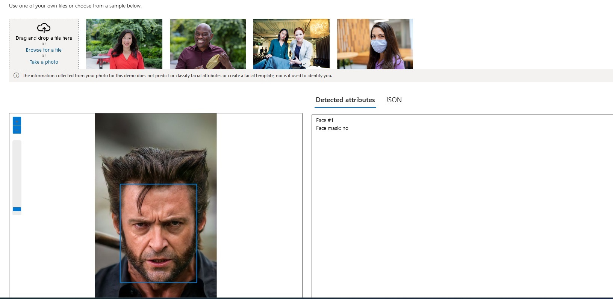
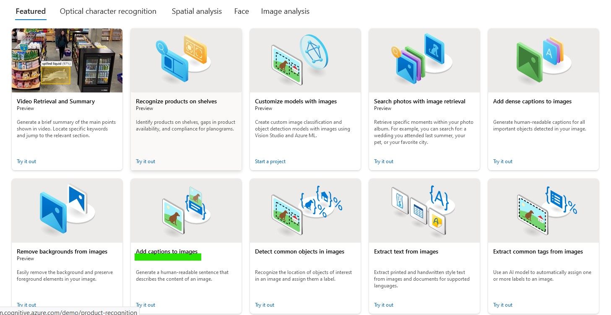
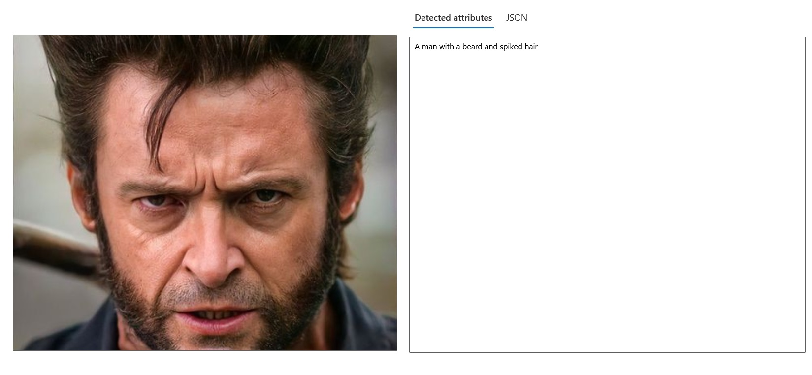

# Utilizando o Vision Studio para identificar rostos e adicionar descrição às imagens

## Detectando rostos em uma imagem
Através desse recurso, a IA identifica rostos contidos na imagem e os numera.

01 - Dentro do Vision Studio, na guia *face* clique na opção *Detect faces in an image*:
 

02 - Este recurso tras imagens como exemplo para teste e possibilidade de upload. Eu fiz o upload da foto do Hugh Jackman, o famoso wolverine dos cinemas:
 

...

## Adicione legendas às imagens
Com esse recurso, a IA adiciona descrição às imagens adicionadas.

01 - Dentro do Vision Studio, na guia *Image analysis* clicamos na opção *Add captions to images*:
 

02 - O recurso trás algumas imagens de exemplo para que você realize testes do serviço e até mesmo a possibilidade de realizar upload de uma. No meu caso, fiz o upload e minha imagem foi toda descrita, com detalhes específicos:
 

...

## O que aprendi?

Entendi que as ferramentas de visão são uma são uma ferramentas muito poderosas para podem auxiliar em diversos setores da economia. Podem auxiliar fabricas em sua linha de produção, ajudar no combate ao crime com a detecção por por reconhecimento facial. E a tendencia é que esses sistemas continuem evolundo para trazer beneficios a sociadade.
