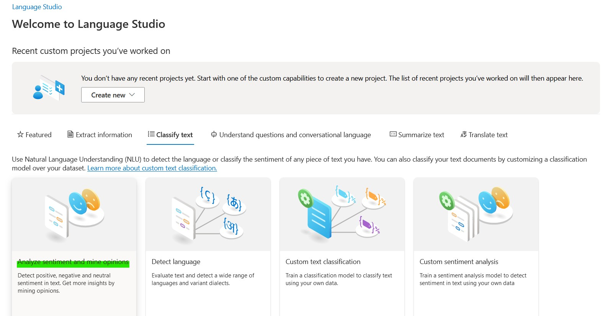
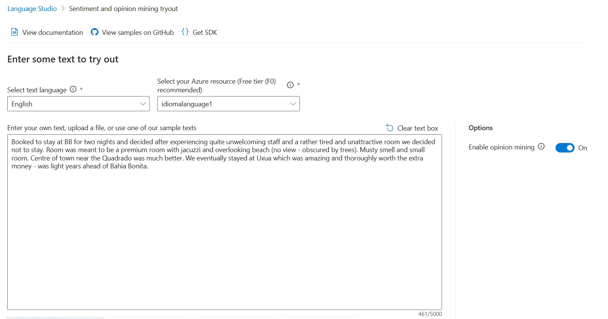
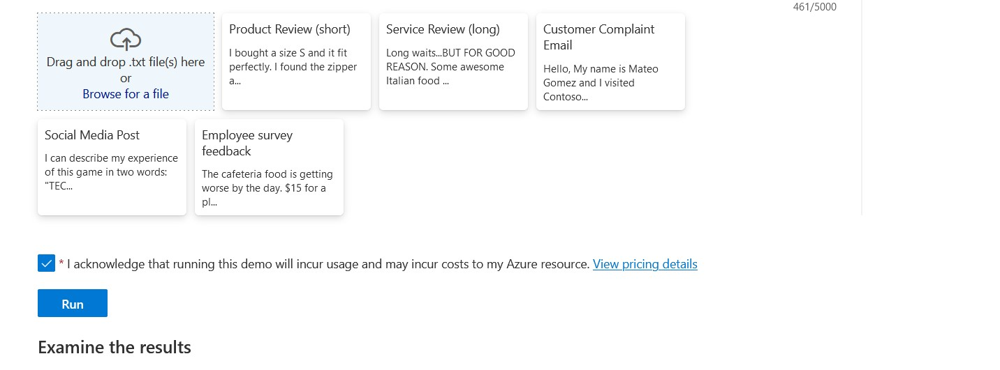
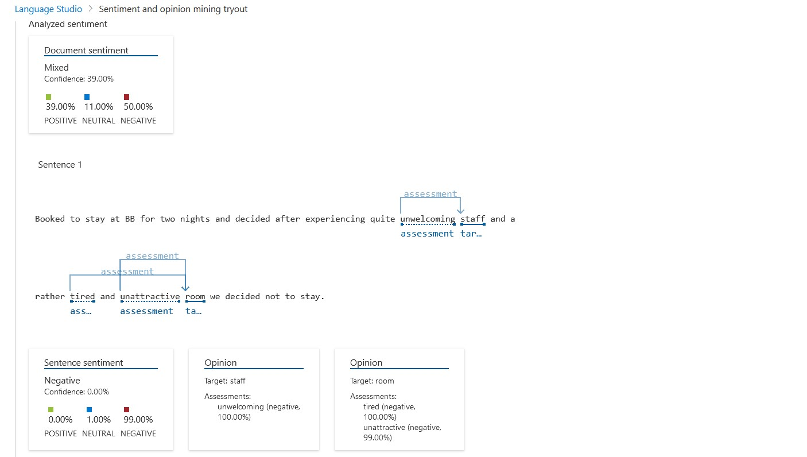
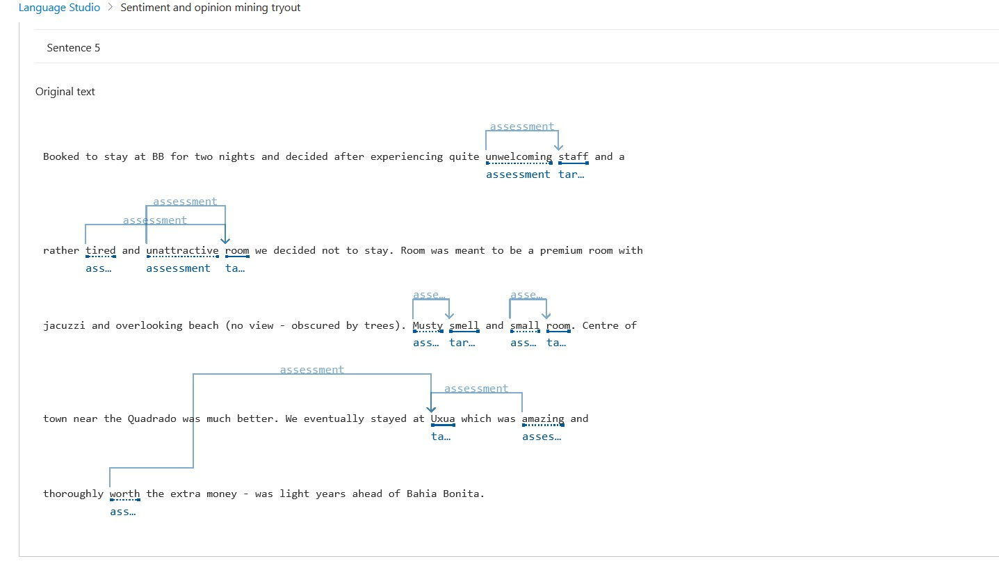

# Análise de Sentimentos com o Language Studio

## Analise o sentimento e extraia opiniões
Através desse recurso, a IA lê o texto e retorna uma análise de sentimentos, podendo ser negativas positivas ou neutras.

01 - Dentro do Language Studio, na guia *Classify text* clique na opção *Analyse sentiment and mine opinions*:
 

02 - Em seguida, selecionamos a linguagem do texto que vamos adicionar (no meu caso, optei por inglês), deixamos selecionados o *resource*, fazemos o upload do nosso arquivo.txt, selecionamos a caixa e então apertamos no botão azul *Run*!
 

Abaixo, continuação:
 

03 - Então, a IA faz a leitura e nos trás os sentimentos contidos naquele texto, como podemos ver a seguir:
 

04 - Abaixo, podemos ver com mais detalhes como funciona o entendimento e a segmentação realizada pela IA:
 

## O que aprendi?
Aprendi que a analise de sentimentos é uma ferramenta muito poderosa para empresas obterem um feedback em relação ao seus produtos e serviços. A integilência artificial faz tudo o trabalho que um humano levara fazendo só que uma escala muito maior.