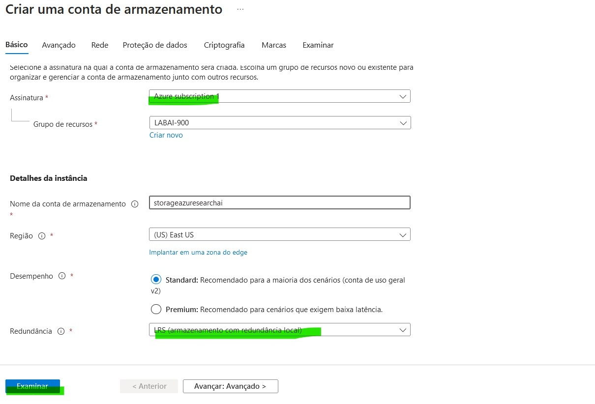
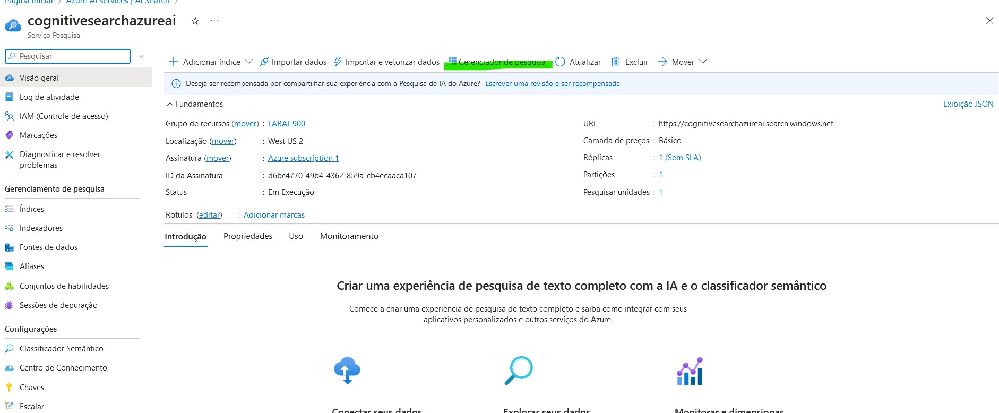

   
# Azure Cognitive Search: Utilizando AI Search para indexação e consulta de dados


## O que precisa ser feito?

O desafio propõe que seja criada uma pesquisa que funcione juntamente com um serviço de inteligência artificial para identificar palavras chave e sentimentos (utilizando também o serviço de armazenamento do Azure).

[Documentação](https://microsoftlearning.github.io/mslearn-ai-fundamentals/Instructions/Labs/11-ai-search.html)

## Primeira etapa: Criando recurso do Azure AI Search   

01 - Clique em "Azure AI Search" e vá em "Criar"

 

02 - Configure dessa maneira (altere o nome do recurso para a maneira que preferir)
 

03 - Aguarde terminar a implantação
 

## Segunda etapa: Criando recurso do Azure AI Services  

01 - Clique em "Serviços Cognitivos" e configure da maneira que já vimos anteriormente nos LAB's anteriores


02 - Aguarde implantação


## Terceira etapa: Criando o armazenamento (storage) 

01 - Clique na opção "Contas de armazenamento"


02 - Em seguida, vamos na opção "Criar"


03 - Configure dessa maneira (se surgir alguma dúvida, consulte a documentação linkada acima), clique em "Examinar", avance e clique em "Criar"


## Quarta etapa: Permitindo acesso anônimo ao Blob  

Como nosso laboratório é apenas didático (com o objetivo de aprender os princípios da inteligência artificial com o Azure), precisamos permitir o acesso anônimo ao blob para simplificar e facilitar nossas implementações!

01 - Após criar o armazenamento, entre no mesmo e navegue até a guia "Configurações" e clique em "Configuração", marcando as opções abaixo. Logo após, clique em "Salvar":


## Quinta etapa: Criando o container 

01 - Ainda dentro do armazenamento que foi criado, navegue até a aba "Armazenamento de dados" e selecione a opção "contêineres". E então, clique na opção "+Contêiner":


02 - Logo em seguida, preencha a aba "Nome" com "coffeereviews" e configure da maneira que está exposta na imagem abaixo:


## Sexta etapa: Carregar o Blob

01 - Selecione o contêiner que foi criado (nesse caso, "coffeereviews"):


02 - Na nova página, vá na opção "Carregar": 


03 - Faça o download dos arquivos na documentação linkada acima e, logo em seguida, faça o upload dos arquivos baixados:


## Sétima etapa: Importação e indexação dos dados

01 - Voltamos para o AI Search, selecione o elemento criado e então clique na opção "Importar dados":


02 - Na próxima etapa, em "Conectar a seus dados", na parte "Fonte de dados", selecione "Armazenamento de Blob do Azure":


05 - Daqui para frente, recomendo que siga a [documentação](https://microsoftlearning.github.io/mslearn-ai-fundamentals/Instructions/Labs/11-ai-search.html) para facilitar a compreensão dos passos necessários! Vá até o passo 17 e então volte para continuarmos :)

## Última etapa: Consulta ao índice

01 - Depois de importamos os dados, chegou o momento da última etapa. Vamos na opção "Gerenciador de pesquisa":


02 - Logo em seguida, vamos utilizar um comando que vai verificar se a indexação foi feita corretamente e mostra os documentos:


OBS: copie e cole o código abaixo
```
search=*&$count=true 
```

03 - Com outro código, verificamos as ocorrências que aconteceram em Chicago:


```


## O que foi observado:  

É impressionante o poder das ferramentas do Microsoft Azure! Facilitam a consulta em documentos, pesquisas e depoimentos, facilitando demais o processo de filtrar determinadas situações.