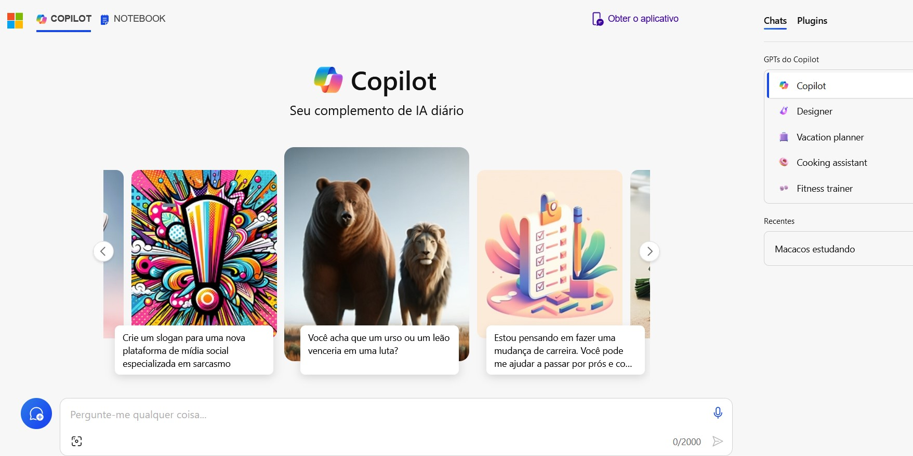
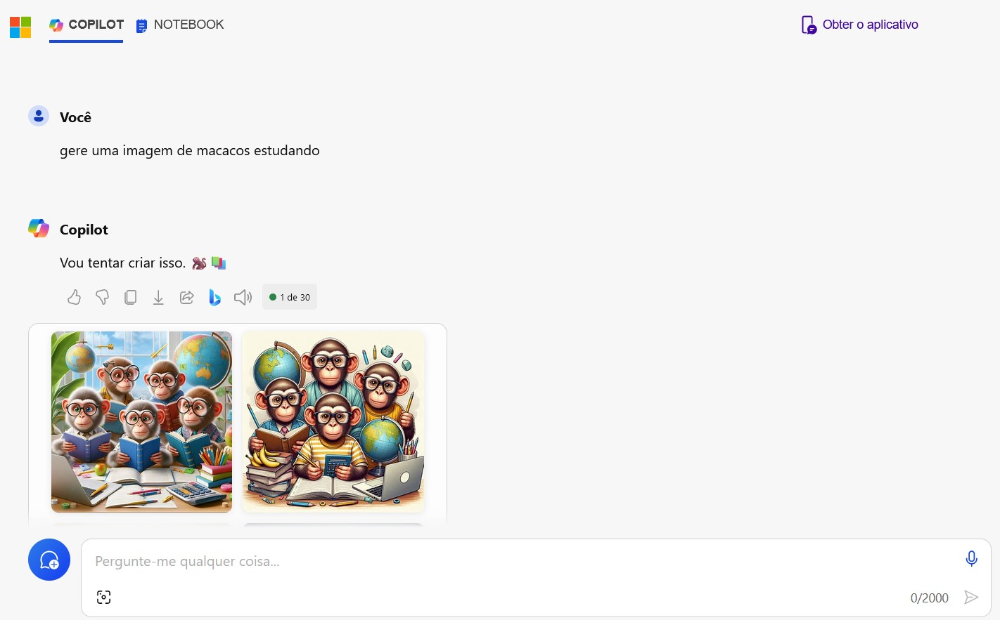

# IA Generativa: Utilizando o Copilot e OpenAI

## O que precisa ser feito?

O desafio propõe que, com a utilização do Microsoft Copilot, sejam geradas imagens criadas pela IA Generativa.

[Microsoft Copilot](copilot.microsoft.com)

## Primeira etapa: Acessando o Copilot 

01 - Entre no link disponibilizado acima e acesse o Microsoft Copilot

## Segunda etapa: Gerando as imagens

01 - Escreva o que você quer que seja criado (no meu caso, um cachorro salsicha em um universo cyberpunk)
 

02 - Espere um pouco e então as imagens serão geradas como podemos ver abaixo:
 

## O que aprendi?  

As ferramentas de IA Generativa são fontes poderosas de imagens, nos permitindo a pensar fora da caixa. Os resultados gerados são bem interessantes e te ajudam a desenvolver mais ainda o seu pensamento criativo!